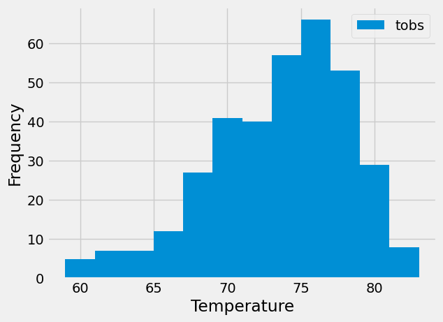

# SQLAlchemy Challenge

<H1><strong>
Surfs Up </strong></H1>

#### Planning for a long vacation in Honolulu, Hawaii, conduct a climate analysis about the area. 
#
## Part 1: Analyze and Explore Climate Data
### Conduct basic climate analysis and data referencing climate databases. 
____
### Tools
* Python
* SQLAlchemy
* ORM Queries
* Pandas
* Matplotlib
### Resources
* Starter Notebook
* Hawaii SQLite database
* Hawaii measurements and Hawaii stations csv files
____
### Precipitation Analysis
* Find the most recent date in the dataset.
* Design a query using the date and precipitation values to retrieve the last 12 months of precipitation data.   
* Create a Pandas DataFrame to load the query results using the date column as the index.  
* Sort by date and plot the results in a bar chart.
   
|  | Precipitation|
|----------|----------|
|count| 2021|
|mean | 0.18|
|std | 0.46|
|min| 0.00|
| 25%| 0.00|
|50%| 0.02|
|75%| 0.13|
|max|6.70|   
----
## Station Analysis   
* Query the total number of stations.
* Find the most active stations.
    * List the stations and observation counts in descending order.
    * The station id with the greatest number of observations is: USC00519281.
* Calculate the lowest, highest, and average temperature from the identified station.
    * Minimum Temperature: 54
    * Highest Temperature: 85
    * Average Temperature: 71.66
### 12 month temperature observations histogram

____
## Part 1: Analyze and Explore Climate Data
Now that the initial analysis is complete, design a Flask API utilizing the queries that were developed.    

* Use Flask to create routes.
    * Start at the root directory as the home page.
    * List all routes that are available.
* /api/v1.0/preciptiation 
    * Convert the query results from the precipitation analysis for the last 12 months of data to a dictionary using date as a key and prcp as the value.
    * Return the JSON representation of the dictionary.
* /api/v1.0/stations
    * Return a JSON list of stations from the dataset.
* /api/v1.0/tobs
    * Query the dates and temperature observations from the most active station for the previous year of data.
    * Return a JSON list of observations.
* /api/v1.0/<start> and /api/v1.0/<start>/<end>
    * Return a JSON list of minimum temperature, average temperature, and maximum temperature for a specified start date or a specified start and end date range.

